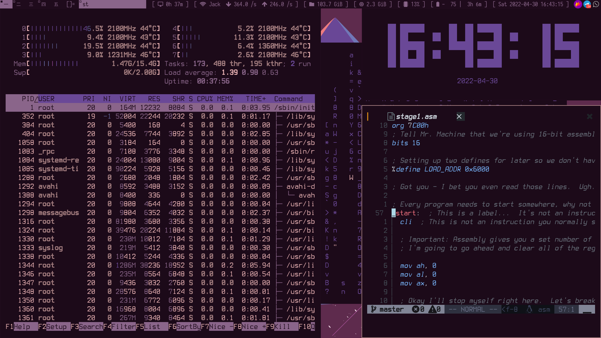

# DWM

The suckless utility is the way to do a low resource usage on your computer. Here's my config.
Use DWM for the window manager, i've already use a few patches such as fibonacci tiling, systray, shiftview.

## Keybinding 

All the keybinding you can see in the ../dwm/config.h 

## Status Bar

Currently using slstatus for the status bar, u can always try using dwmblocks or dwmstatus.Use the Iosevka Nerd Font 

 

## Terminal Emulator

Use The Luke Smith Patch Modified a bit using the different font.  

## Browser

Well... if you are crazy enough just try surf but i recommend just use qutebrowser if you wanna surf the web.

## Sleep Mode

Currently trying to implement the xssstate for the sleep mode for the computer after a view minutes

# dmenu

Just trying to use the simple dmenu to launch app etc. Also if you use pywal then you can have the desired colorscheme just like your wallpaper.  


### Note

After you clone this repo just copy the suckless utility into the .local/src/

example using this command 

```bash
cp suckless-config/* $HOME/.local/src/
```
After that u can just make the program by using 

```bash
sudo make clean install
```

and the .xinitrc or .xsessionrc

add this line

```bash
wal -i {$YOURPICTUREDIRECTORY}            # pywal the picture you want
feh --bg-fill {$YOURPICTUREDIRECTORY}     # fill the background using feh
slstatus &                                # to start slstatus
export _JAVA_AWT_WM_NONREPARENTING=1      # to start android studio if you have one or ghidra
exec dwm                                  # exec the dwm
```

# Results

The Final Results 

 

