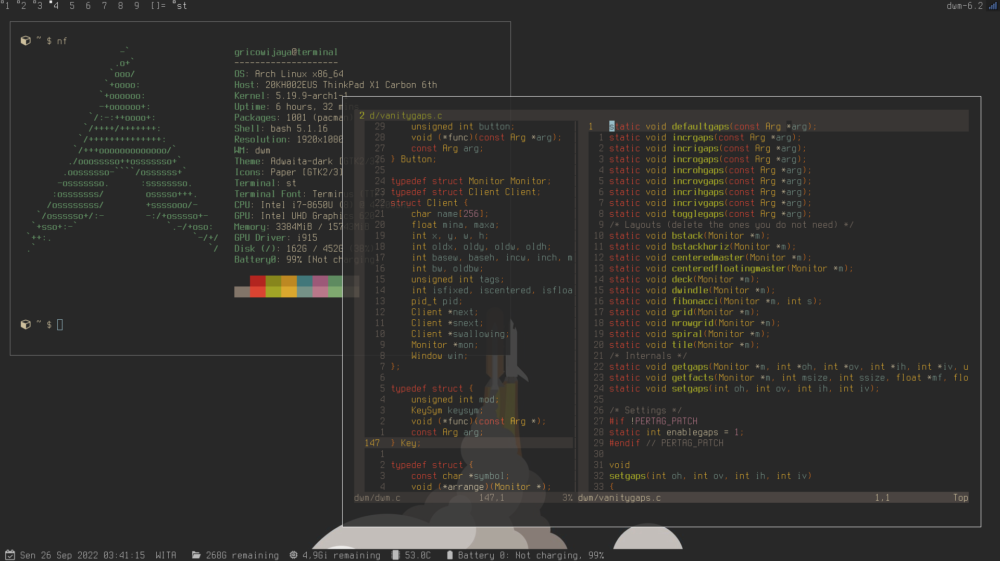
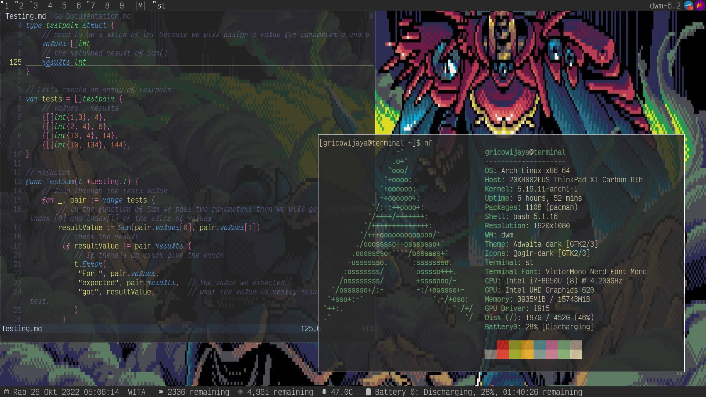

# GeRico's Suckless Utility

This repo is just a collection of my modified suckless program such as `dwm`, `st`, `surf`, `slock`, `tabbed` also some nice program such as `paperview` and nice wallpaper.

## Dependencies

font:
  * Terminus
  * VictorMono Nerd Font
  * Helvetica
  * Open Sans

program:
  * feh  

theme:
  * gruvbox

## Patches

Patches i used in `dwm`. 

  * [shiftview](https://lists.suckless.org/dev/1104/7590.html)
  * [alwaysontop](https://dwm.suckless.org/patches/alwaysontop/)
  * [accessnthmon](https://dwm.suckless.org/patches/accessnthmonitor/)
  * [dualstatus](https://dwm.suckless.org/patches/dualstatus/)
  * [extrabar](https://dwm.suckless.org/patches/extrabar/)
  * [fibonacci](https://dwm.suckless.org/patches/vanitygaps/)
  * [systray](https://dwm.suckless.org/patches/systray/)
  * [swallow](https://dwm.suckless.org/patches/swallow/)
  * [centeredmaster](https://dwm.suckless.org/patches/centeredmaster/)

## Preview

With Terminus Font:

With VictorMono Nerd Font

## Scripts

### Random Animated Wallpaper 

`curseanimwall` to run random animated wallpaper that generated by paperview in the folder `./paperview/wallpaper`

### Random Static Wallpaper

`cursewall` is to run random wallpaper from the `./wallpaper` folder

### Install DWM (On Progress)

`dwminstall` = to install dwm in your computer (might be failed, still on progress) 

### Compile Suckless Utility

It is SUCKS to `cd` into the directory and always type `sudo make install clean` everytime we make changes in source code of the suckless utility so i just create `makesuck`  to compile the suckless utility in the folder `$HOME/.local/src/` 

for example to compile dwm just type 

`makesuck dwm`

instead of

`cd dwm`

`sudo make install clean`

The same thing applied with `st`, `surf`, etc

`makesuck st`

p.s. `makesuck` is just the shortage from `make suckless`

### Restart DWM Without Closing The Window

Everytime we finish compiling then we can use `Super` + `Shift` + `Q` to restart dwm. 

### Bottom Status Bar

I use the scripts of `statusbar` to run the bottom status bar in `dwm`

Todo:
  * install scripts
  * documentation
  * [bidi](https://dwm.suckless.org/patches/bidi/) patch

